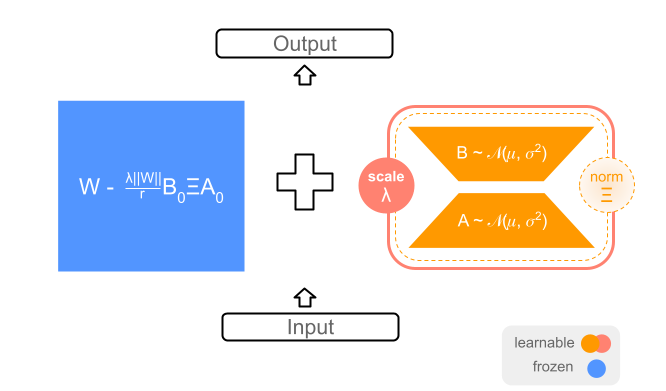

<h1 align="center">
    <p>Decoupling Angles and Strength in Low-rank Adaptation (ICLR2025)</p>
</h1>

<h1 align="center"> 
    
</h1>

Official PyTorch implementation of [**Decoupling Angles and Strength in Low-rank Adaptation**
](https://arxiv.org/abs/2503.18225), M. Bini, L. Girrbach, Z. Akata (ICLR 2025)


[Paper](https://arxiv.org/abs/2503.18225) | [Contact](massimo.bini@uni-tuebingen.de) | [Cite](#Citation)


**TLDR:** DeLoRA effective decouples the angular learning from the adaptation strength. This is done by (i) normalization of BA low-rank matrices, (ii) (learnable) scaling of boundary λ, (iii) layer-wise scaling of ||W|| mimicking multiplicative finetuning.


## Introduction
This repository contains the **training** and **evaluation** code for reproducing the **GLUE** benchmark results, with proper splits in validation and test sets as proposed in [Advancing Parameter Efficiency in Fine-tuning via Representation Editing
](https://arxiv.org/abs/2402.15179).

Revisited GLUE benchmark data splits:
| Splits Sizes      | MNLI  | SST-2 | MRPC | CoLA | QNLI | QQP  | RTE  | STS-B |
|-------------------|-------|-------|------|------|------|------|------|-------|
| Training Set      | 393K  | 67K   | 3.7K | 8.5K | 105K | 364K | 2.5K | 5.7K  |
| New Validation Set| 1K    | 436   | 204  | 522  | 1K   | 1K   | 139  | 750   |
| New Test Set      | 8K    | 436   | 204  | 521  | 4.5K | 39K  | 138  | 750   |

## Quickstart
Create conda environment
```bash
conda env create -f environment.yml
conda activate delora
```

Finetune and evaluate with DeLoRA
```bash
# Select
# - TASK : mnli, sst2, qnli, qqp, rte, stsb, mrpc, cola
# - SEED : 42, 43, 44, 45, 46
bash scripts/glue_eval.sh <TASK> <SEED>  
```

This will generate two log files in the `.logs` folder (e.g. below):
- validation results: `.logs/roberta-base/rte/delora_r8_qv_a4.0_d0.0_lr0.01_bs32_ep80_ml512_dllr0.01_seed42.txt` 
- test results: `'.logs/roberta-base/rte/delora_r8_qv_a4.0_d0.0_lr0.01_bs32_ep80_ml512_dllr0.01_seed42_TEST.txt'`


Results description:
- **validation results** file reports all the models evaluated on the validation set (When doing hyperparameter selection, only use the validation results: select the max validation result on seed 42)
- **test results** file reports all the models where the corresponding validation result is the highest (so far). The last line contains the final test result (Do not use the max value, the selection should be based on the validation results!!)


## Acknowledgments
This code repository builds upon the GLUE data splits from [RED](https://github.com/mlwu22/RED), and the adapters code from [PEFT](https://github.com/huggingface/peft).


## Citation
If you find DeLoRA useful, consider citing our work!
```bibtex
@inproceedings{bini2025decouplinganglesstrengthlowrank,
      title={Decoupling Angles and Strength in Low-rank Adaptation}, 
      author={Massimo Bini and Leander Girrbach and Zeynep Akata},
      year={2025},
  booktitle={International Conference on Learning Representations (ICLR)},
}
```

## License
This code repository is open-sourced under [MIT license](LICENSE).

